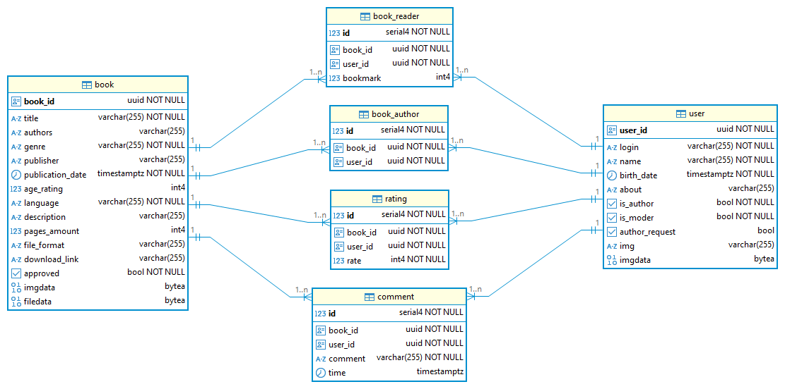

# Описание
Сервис позволяет пользователям читать и скачивать книги, имеющиеся в каталоге. Начинающие авторы могут загружать собственные книги и получать реакцию от читателей (оценки и комментарии).

Читатели могут "взять в аренду" одновременно до 10 книг. Чтобы взять новую, нужно сдать обратно какую-нибудь взятую книгу. Почти как в настоящей библиотеке. Пользователи могут оставлять закладки в книгах и продолжать чтение с места, где они остановились, прямо на сайте.

Для того, чтобы стать автором, нужно отправить запрос модераторам и получить одобрение.

Модератор должен проверять загруженные книги (соответствие содержания возрастному рейтингу, цензура, авторство, жанр и т.д.). Одобренные книги будут отображаться в каталоге, и пользователи смогут их прочитать или скачать.

В каталоге также могут находиться книги из свободного доступа. Их могут загрузить модераторы. Ответственность за авторство, жанр, цензуру и т.д. также лежит на них.

Книги хранятся на сервере.

## Требования
- `Single Page App` в [Auth0](https://auth0.com/)
- `Node.js 22.13+` (для локального запуска)
- `Docker`, `Docker Compose` (для запуска в Docker)

## Запуск
В директориях `/client` и `/server` создать файл `.env` в соответствии с примером `.env.example`.

### Локально
1. Запустить СУБД PostgreSQL (например, в Docker).
2. В каждой из директорий `/client` и `/server` выполнить команды:
```shell
npm install
npm run start
```

### Docker
```shell
docker compose up
```

## Наименование
E-library

## Предметная область
Читатели, книги, авторы

# Данные
### ER-диаграмма


### book
| name             | type         | constraints          |
|------------------|--------------|----------------------|
| book_id          | UUID         | NOT NULL PRIMARY KEY |
| title            | VARCHAR(255) | NOT NULL             |
| authors          | VARCHAR(255) |
| genre            | VARCHAR(255) | NOT NULL             |
| publisher        | VARCHAR(255) |
| publication_date | DATE         | NOT NULL             |
| age_rating       | INT          |
| language         | VARCHAR(255) | NOT NULL             |
| description      | TEXT         |
| pages_amount     | INT          |
| file_format      | VARCHAR(255) |
| download_link    | VARCHAR(255) | 
| approved         | BOOL         | NOT NULL             |
| imgdata          | BYTEA        |
| filedata         | BYTEA        |

### user
| name           | type         | constraints          |
|----------------|--------------|----------------------|
| user_id        | UUID         | NOT NULL PRIMARY KEY |
| login          | VARCHAR(255) | NOT NULL             |
| name           | VARCHAR(255) | NOT NULL             |
| birth_date     | DATE         | NOT NULL             |
| about          | TEXT         |
| is_author      | BOOL         | NOT NULL             |
| is_moder       | BOOL         | NOT NULL             |
| author_request | BOOL         |
| img            | VARCHAR(255) |
| imgdata        | BYTEA        |

`UNIQUE(login)`

- `author_request` - был ли пользователем отправлен запрос на становление автором  

### book_reader
Определяет отношение между книгами и читателями

| name     | type | constraints                                    |
|----------|------|------------------------------------------------|
| id       | INT  | NOT NULL PRIMARY KEY                           |
| book_id  | UUID | NOT NULL, FOREIGN KEY(book), ON DELETE CASCADE |
| user_id  | UUID | NOT NULL, FOREIGN KEY(user), ON DELETE CASCADE |
| bookmark | INT  |

`UNIQUE(book_id, user_id)`

### book_author
Определяет отношение между книгами и авторами

| name    | type | constraints                                    |
|---------|------|------------------------------------------------|
| id      | INT  | NOT NULL PRIMARY KEY                           |
| book_id | UUID | NOT NULL, FOREIGN KEY(book), ON DELETE CASCADE |
| user_id | UUID | NOT NULL, FOREIGN KEY(user), ON DELETE CASCADE |

`UNIQUE(book_id, user_id)`

### rating
Оценки к книгам

| name    | type | constraints                                    |
|---------|------|------------------------------------------------|
| id      | INT  | NOT NULL PRIMARY KEY                           |
| book_id | UUID | NOT NULL, FOREIGN KEY(book), ON DELETE CASCADE |
| user_id | UUID | NOT NULL, FOREIGN KEY(user), ON DELETE CASCADE |
| rate    | INT  | NOT NULL                                       |

`UNIQUE(book_id, user_id)`

### comment
Комментарии к книгам

| name     | type      | constraints                                    |
|----------|-----------|------------------------------------------------|
| id       | INT       | NOT NULL PRIMARY KEY                           |
| book_id  | UUID      | NOT NULL, FOREIGN KEY(book), ON DELETE CASCADE |
| user_id  | UUID      | NOT NULL, FOREIGN KEY(user), ON DELETE CASCADE |
| comment  | TEXT      | NOT NULL                                       |
| time     | TIMESTAMP |

## Общие ограничения целостности
- Связь *многие-ко-многим* между таблицами `book` и `user` (`book_reader`)
- Связь *многие-ко-многим* между таблицами `book` и `user` (`book_author`)
- Связь *многие-ко-многим* между таблицами `book` и `user` (`rating`)
- Связь *многие-ко-многим* между таблицами `book` и `user` (`comment`)

# Пользовательские роли
### Читатель (кол-во: не ограничено)
- каждый пользователь по умолчанию
- может "брать в аренду" до 10 книг
- может скачивать книги
- может делать закладки в арендованных книгах
- может оценивать книги
- может оставлять комментарии
- может удалять свои оценки и комментарии

### Автор (кол-во: не ограничено)
- может то же, что и читатель
- может загружать свои книги

### Модератор (минимум 1 человек)
- может то же, что и автор
- может загружать другие книги, находящиеся в свободном доступе
- может одобрять книги, загруженные авторами
- может удалять книги
- может назначать и убирать авторов
- может назначать и удалять других модераторов
- может удалять чужие комментарии

# Технологический стек

### 1. Frontend
- **Фреймворк:** `React` (JavaScript)

### 2. Backend
- **Сервер:** `Node.js`/`Express` (JavaScript)
- **ORM:** `Sequelize`
- **СУБД:** `PostgreSQL`

### 3. Инфраструктура и безопасность
- **Реверс-прокси:** `Nginx` (проксирование запросов к API)
- **Аутентификация и авторизация:** `Auth0`
